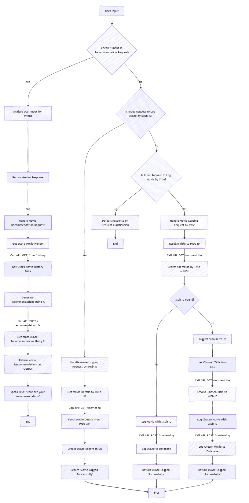

# Journey Chatbot

## Overview

Journey is an AI-powered chatbot designed to process voice input and assist users with movie recommendations, logging movies, or exiting the conversation. The bot processes user commands and utilizes APIs to perform tasks like retrieving movie recommendations, logging movies, and managing user preferences.

### Features:
1. **Speech Input (Speech-to-Text)**: Converts user’s spoken input into text.
2. **Random Gibberish Handling**: Detects non-meaningful input and asks the user to try again.
3. **Movie Recommendation Request**: Provides movie recommendations using sentiment analysis and previous user history.
4. **Logging Movie Request**: Allows the user to log a movie by either saying a title or using a related term.
5. **Exit Command**: Recognizes when the user wants to exit the conversation.

## Detailed Functionality

### 1. Speech Input (Speech-to-Text)
**Functionality**:  
The first step in the process is to listen for the user’s speech input, convert it into text, and then process that text in various ways depending on its content. This is achieved using the `speech_recognition` library (with Google's speech-to-text API) to capture the user's spoken command.

**Flow**:
- The program listens for a user command.
- Once the audio is captured, it converts it to text and prints what the user said.
- The text is then analyzed to determine if it falls into one of the four categories: random gibberish, recommendation request, logging request, or exit.

### 2. Handling Random Gibberish (Command: Non-Meaningful Input)
**Functionality**:  
If the AI detects that the input does not make sense (e.g., gibberish or unclear speech), it will ask the user to try again. This is achieved by analyzing the speech with an OpenAI model.

**Flow**:
- The AI checks if the user’s input seems meaningful using sentiment analysis and intent recognition.
- If it does not recognize the intent (based on patterns like "recommend," "log," or "exit"), it will prompt the user to try again.

### 3. Movie Recommendation Request
**Functionality**:  
If the user asks for a movie recommendation (either directly or indirectly), the AI uses sentiment analysis to interpret the meaning of the user's request and understand if the user is asking for a recommendation, even if they don't use the word "recommend."

**Flow**:
- The input is analyzed by the OpenAI model (`analyze_intent` function) to check if it's a recommendation request.
- If the intent is confirmed (e.g., phrases like "suggest," "recommend," etc.), the program will retrieve the user’s movie history from a database (likely using a SQLAlchemy session), and then pass the list of previously watched movies to the recommendation engine.
- The recommendation system works by generating movie recommendations based on the user’s movie preferences (using OpenAI and IMDb data).
- The list of recommended movies is then presented to the user, and a text-to-speech engine (`pyttsx3`) will read the recommendations aloud to the user.

### 4. Logging Movie Request
**Functionality**:  
If the user mentions logging a movie (or says something related to logging, like the title of a movie), the program will attempt to cross-reference the title with IMDb to find a match. If an exact match isn't found, it will provide the user with a list of similar titles. The user will then choose a corresponding number to confirm the correct movie.

**Flow**:
- If the user mentions logging a movie or providing a title, the program checks IMDb for an exact match (via the `get_imdb_id_from_title` function).
- If there’s no exact match, it will use the OMDb API to search for similar titles.
- The program presents a list of similar movies, and the user selects a movie by number.
- Once the movie is selected, the program logs the movie in the database (via `handle_logging_request`).
- This step involves calling a function that retrieves movie details (e.g., genre, plot, year) from IMDb, and then logs the movie along with a rating or review.

### 5. Exit Command
**Functionality**:  
If the user wants to exit the conversation, they can say "exit." The chatbot will recognize this and reply with a "goodbye" message.

**Flow**:
- The AI recognizes phrases like "exit," "goodbye," or similar commands.
- Once this command is detected, the chatbot will say goodbye using text-to-speech (via `SpeakText` function) and end the conversation.

## Breakdown of Core Components and Libraries

### Speech Recognition:
- **Library**: `speech_recognition`
- **API**: Google’s Speech-to-Text API
- **Functionality**: Converts the user’s spoken input into text.

### Text-to-Speech:
- **Library**: `pyttsx3`
- **Functionality**: Converts text back into speech (used for the AI to speak back to the user).

### Natural Language Understanding (Intent Analysis):
- **API**: OpenAI's GPT model (specifically GPT-4)
- **Functionality**: Analyzes the user's text to determine their intent (e.g., if they are asking for a recommendation, logging a movie, or giving gibberish). This is done through the `analyze_intent` function, which sends the user’s query to the OpenAI model to classify it as one of the four categories.

### Movie Database & Recommendation:
- **API**: OMDb API
- **Functionality**: Fetches movie details like title, genre, plot, and IMDb ID using the movie title or IMDb ID.
- **Flow**: Once a user’s movie preference is understood, a recommendation engine will suggest movies based on the genres and plots of previously watched movies.

### Logging Movies:
- **Functionality**: Once a movie is selected (either via IMDb search or similar titles list), the program logs it to the user's movie history in a database using SQLAlchemy.

## Example Interaction:

### User Says: "Can you suggest a movie?"
- The program recognizes the intent as a recommendation request, processes the user’s history, and uses sentiment analysis to understand that the user is looking for suggestions.
- The AI then provides movie recommendations, such as “Here are a few suggestions: Movie A, Movie B, and Movie C.”

### User Says: "I want to log The Matrix"
- The program will search IMDb for “The Matrix.”
- If there’s no exact match, it will list similar titles, e.g., “Matrix Reloaded,” “Inception,” and “Equilibrium.” The user picks a number.
- The movie is then logged into the database.

### User Says: "Exit"
- The program says, “Goodbye” and ends the interaction.

## Conclusion

In summary, this chatbot (Journey) is designed to process speech input and categorize it into one of four possible actions: asking for a movie recommendation, logging a movie, providing a list of similar movie titles, or exiting the conversation. It leverages several APIs (Google Speech-to-Text, OMDb, and OpenAI) and models to perform these tasks intelligently, while also incorporating a database to manage user data and preferences. The program ensures a seamless user experience by responding with appropriate speech outputs at each stage of the interaction.

## db.py 

This section of the code sets up the database connection and provides utilities for interacting with the database using FastAPI and SQLModel. It defines a SQLite database connection, provides a function to create the database and tables, and uses dependency injection to manage database sessions in the FastAPI app.

## Code Breakdown

### 1. Database Connection Setup
sqlite_file_name: The name of the SQLite database file, database.db.
sqlite_url: The URL used to connect to the SQLite database.
connect_args: Contains connection options for SQLite, such as check_same_thread, which is required for using SQLite with FastAPI in a multi-threaded environment.
engine: Creates the SQLAlchemy engine used to interact with the SQLite database.

### 2. Create Database and Tables

create_db_and_tables: This function creates the database tables by using the metadata of the SQLModel (which holds the schema definitions). It calls create_all(engine) to create all the tables defined in the models associated with the engine.

### 3. Database Session Management
get_session: A generator function that provides a database session. The session is created using the Session class and the engine. The yield statement ensures that the session is available to be used in the FastAPI routes.

### 4. Dependency Injection for Database Sessions

    SessionDep: This is a type alias for a FastAPI dependency that provides a Session object. It uses the Depends function to inject the database session wherever it's needed in the FastAPI routes. The session is automatically closed when it is no longer needed.

### Usage

    Creating the Database: The create_db_and_tables() function must be called once to create the initial database tables.

    Database Sessions in FastAPI: The SessionDep dependency can be used in route functions to interact with the database

#### helpers.py
# Movie Management with FastAPI and SQLModel

## Overview

This section of the code provides functionality for managing movies within a database. It includes features such as adding new movies, retrieving movies by user ID, updating movie details, and fetching movie information from the OMDb API using IMDb IDs. The application uses FastAPI, SQLModel, and requests to interact with a database and external API.

## Code Breakdown

### 1. Creating a Movie
create_movie: This function adds a new movie to the database. Before adding, it checks if a movie with the same imdb_id and user_id already exists. If it does, it returns the existing movie; otherwise, it adds the new movie and commits the changes.

### 2. Retrieving Movies by User ID

get_movies_by_user_id: This function retrieves all movies associated with a specific user_id from the database.

### 3. Getting a Movie by ID
get_movie_by_id: This function retrieves a movie from the database using its movie_id.

### 4. Updating Movie Details
update_movie: This function allows updating an existing movie in the database. It fetches the movie by movie_id, updates its details, and commits the changes.

### 5. Fetching IMDb ID from Movie Title
get_imdb_id_from_title: This function fetches the IMDb ID of a movie from the OMDb API using its title.

### 6. Fetching Movie Details from IMDb

get_movie_details: This function fetches detailed movie information from the OMDb API based on the IMDb ID. It processes the response to return the movie title, genre, plot, year, and poster image.

### 7. Creating a Movie from IMDb ID

create_movie_from_imdb_id: This function creates a new movie in the database using the IMDb ID. It fetches the movie details using get_movie_details() and then creates and saves a new Movie object in the database.

### 8. Timeline Generation
timeline_generator: This function generates a timeline of movies for a user, ordered by the date they were watched. It yields each movie in the sorted list.

### 9. Getting a Movie by Title

get_movie_by_title: This function retrieves a movie by its title from the database.

### 10. Fetching Movie Title from OMDb API

get_movie_title_api: This function fetches the movie title from the OMDb API based on the provided title.

### 11. Test Functions
test_functions: A helper function to test the functionality of all the above functions. It creates a test movie from IMDb, retrieves it by ID, title, and generates the user's movie timeline.

#### main.py

Features

    User Registration: Users can register with a unique user ID.
    Movie Management: Users can add, update, and view movies they’ve watched.
    Movie Suggestions: Search for movies by title using the OMDb API.
    Movie Recommendations: Personalized movie recommendations based on a user's movie history.
    Authentication: Basic authentication with username and password.

Endpoints
### 1. User Registration

POST /register/
Register a new user by providing a user_id and password.

### 2. Movie Suggestion

GET /suggest_movies/{current_param}
Suggest a list of movies based on the search query (movie title).

### 3. Create Movie

POST /movies/
Create a new movie entry for the authenticated user. If the imdb_id is not provided, it will be fetched using the movie title.

### 4. Get Movies by User ID

GET /movies/
Retrieve all movies added by the authenticated user.

### 5. Update Movie

PUT /movie/{movie_id}
Update an existing movie entry for the authenticated user by movie ID.

Parameters: movie_id: The ID of the movie to be updated.

### 6. Movie Recommendations
    GET /recommend_movies/
    Get personalized movie recommendations based on the movies the user has watched.

### models.py
### 1. Movie Model

Represents a movie in the database.
Fields:

    id (int, optional): Primary key for the movie record. Auto-incremented if not provided.
    imdb_id (str): Unique identifier for the movie, retrieved from IMDB.
    title (str): The title of the movie.
    year (int): The release year of the movie.
    plot (str): A brief plot summary of the movie.
    poster (str): URL to the poster image of the movie.
    genre (str): The genre(s) of the movie.
    date_watched (str): The date when the user watched the movie.
    review (str): The user's review of the movie.
    rating (int): The user's rating of the movie (typically 1-10).
    user_id (str): Foreign key to the User table, referencing the user who logged the movie.

### 2. User Model

Represents a user in the system.
Fields:
    user_id (str): The unique identifier for the user (primary key).
    password (str): The user's password, stored securely.

