# Film Odessey

## Overview

Film Odessey uses Journey an AI-powered chatbot designed to process voice input and assist users with movie recommendations, logging movies, or exiting the conversation. The bot processes user commands and utilizes APIs to perform tasks like retrieving movie recommendations, logging movies, and managing user preferences. It tracks the user preferences and suggests recommendations based on that.

### Features:
1. **Speech Input (Speech-to-Text)**: Converts user’s spoken input into text.
2. **Random Gibberish Handling**: Detects non-meaningful input and asks the user to try again.
3. **Movie Recommendation Request**: Provides movie recommendations using sentiment analysis and previous user history.
4. **Logging Movie Request**: Allows the user to log a movie by either saying a title or using a related term.
5. **Exit Command**: Recognizes when the user wants to exit the conversation.

## Detailed Functionality

### 1. Speech Input (Speech-to-Text)
**Functionality**:  
The first step in the process is to listen for the user’s speech input, convert it into text, and then process that text in various ways depending on its content. This is achieved using the `speech_recognition` library (with Google's speech-to-text API) to capture the user's spoken command.

**Flow**:
- The program listens for a user command.
- Once the audio is captured, it converts it to text and prints what the user said.
- The text is then analyzed to determine if it falls into one of the four categories: random gibberish, recommendation request, logging request, or exit.

### 2. Handling Random Gibberish (Command: Non-Meaningful Input)
**Functionality**:  
If the AI detects that the input does not make sense (e.g., gibberish or unclear speech), it will ask the user to try again. This is achieved by analyzing the speech with an OpenAI model.

**Flow**:
- The AI checks if the user’s input seems meaningful using sentiment analysis and intent recognition.
- If it does not recognize the intent (based on patterns like "recommend," "log," or "exit"), it will prompt the user to try again.

### 3. Movie Recommendation Request
**Functionality**:  
If the user asks for a movie recommendation (either directly or indirectly), the AI uses sentiment analysis to interpret the meaning of the user's request and understand if the user is asking for a recommendation, even if they don't use the word "recommend."

**Flow**:
- The input is analyzed by the OpenAI model (`analyze_intent` function) to check if it's a recommendation request.
- If the intent is confirmed (e.g., phrases like "suggest," "recommend," etc.), the program will retrieve the user’s movie history from a database (likely using a SQLAlchemy session), and then pass the list of previously watched movies to the recommendation engine.
- The recommendation system works by generating movie recommendations based on the user’s movie preferences (using OpenAI and IMDb data).
- The list of recommended movies is then presented to the user, and a text-to-speech engine (`pyttsx3`) will read the recommendations aloud to the user.

### 4. Logging Movie Request
**Functionality**:  
If the user mentions logging a movie (or says something related to logging, like the title of a movie), the program will attempt to cross-reference the title with IMDb to find a match. If an exact match isn't found, it will provide the user with a list of similar titles. The user will then choose a corresponding number to confirm the correct movie.

**Flow**:
- If the user mentions logging a movie or providing a title, the program checks IMDb for an exact match (via the `get_imdb_id_from_title` function).
- If there’s no exact match, it will use the OMDb API to search for similar titles.
- The program presents a list of similar movies, and the user selects a movie by number.
- Once the movie is selected, the program logs the movie in the database (via `handle_logging_request`).
- This step involves calling a function that retrieves movie details (e.g., genre, plot, year) from IMDb, and then logs the movie along with a rating or review.

### 5. Exit Command
**Functionality**:  
If the user wants to exit the conversation, they can say "exit." The chatbot will recognize this and reply with a "goodbye" message.

**Flow**:
- The AI recognizes phrases like "exit," "goodbye," or similar commands.
- Once this command is detected, the chatbot will say goodbye using text-to-speech (via `SpeakText` function) and end the conversation.

## Breakdown of Core Components and Libraries

### Speech Recognition:
- **Library**: `speech_recognition`
- **API**: Google’s Speech-to-Text API
- **Functionality**: Converts the user’s spoken input into text.

### Text-to-Speech:
- **Library**: `pyttsx3`
- **Functionality**: Converts text back into speech (used for the AI to speak back to the user).

### Natural Language Understanding (Intent Analysis):
- **API**: OpenAI's GPT model (specifically GPT-4)
- **Functionality**: Analyzes the user's text to determine their intent (e.g., if they are asking for a recommendation, logging a movie, or giving gibberish). This is done through the `analyze_intent` function, which sends the user’s query to the OpenAI model to classify it as one of the four categories.

### Movie Database & Recommendation:
- **API**: OMDb API
- **Functionality**: Fetches movie details like title, genre, plot, and IMDb ID using the movie title or IMDb ID.
- **Flow**: Once a user’s movie preference is understood, a recommendation engine will suggest movies based on the genres and plots of previously watched movies.

### Logging Movies:
- **Functionality**: Once a movie is selected (either via IMDb search or similar titles list), the program logs it to the user's movie history in a database using SQLAlchemy.

## Example Interaction:

### User Says: "Can you suggest a movie?"
- The program recognizes the intent as a recommendation request, processes the user’s history, and uses sentiment analysis to understand that the user is looking for suggestions.
- The AI then provides movie recommendations, such as “Here are a few suggestions: Movie A, Movie B, and Movie C.”

### User Says: "I want to log The Matrix"
- The program will search IMDb for “The Matrix.”
- If there’s no exact match, it will list similar titles, e.g., “Matrix Reloaded,” “Inception,” and “Equilibrium.” The user picks a number.
- The movie is then logged into the database.

### User Says: "Exit"
- The program says, “Goodbye” and ends the interaction.

## Conclusion

In summary, this chatbot (Journey) is designed to process speech input and categorize it into one of four possible actions: asking for a movie recommendation, logging a movie, providing a list of similar movie titles, or exiting the conversation. It leverages several APIs (Google Speech-to-Text, OMDb, and OpenAI) and models to perform these tasks intelligently, while also incorporating a database to manage user data and preferences. The program ensures a seamless user experience by responding with appropriate speech outputs at each stage of the interaction.

## db.py 

This section of the code sets up the database connection and provides utilities for interacting with the database using FastAPI and SQLModel. It defines a SQLite database connection, provides a function to create the database and tables, and uses dependency injection to manage database sessions in the FastAPI app.

## Code Breakdown

### 1. Database Connection Setup
sqlite_file_name: The name of the SQLite database file, database.db.
sqlite_url: The URL used to connect to the SQLite database.
connect_args: Contains connection options for SQLite, such as check_same_thread, which is required for using SQLite with FastAPI in a multi-threaded environment.
engine: Creates the SQLAlchemy engine used to interact with the SQLite database.

### 2. Create Database and Tables

create_db_and_tables: This function creates the database tables by using the metadata of the SQLModel (which holds the schema definitions). It calls create_all(engine) to create all the tables defined in the models associated with the engine.

### 3. Database Session Management
get_session: A generator function that provides a database session. The session is created using the Session class and the engine. The yield statement ensures that the session is available to be used in the FastAPI routes.

### 4. Dependency Injection for Database Sessions

    SessionDep: This is a type alias for a FastAPI dependency that provides a Session object. It uses the Depends function to inject the database session wherever it's needed in the FastAPI routes. The session is automatically closed when it is no longer needed.

### Usage

    Creating the Database: The create_db_and_tables() function must be called once to create the initial database tables.

    Database Sessions in FastAPI: The SessionDep dependency can be used in route functions to interact with the database

#### helpers.py
# Movie Management with FastAPI and SQLModel
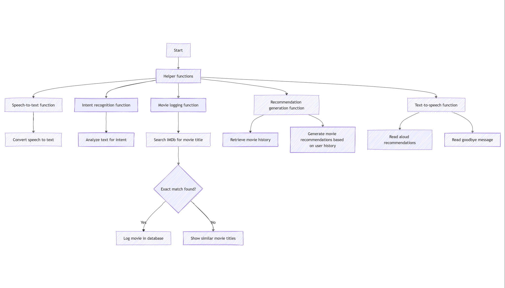
## Overview

This section of the code provides functionality for managing movies within a database. It includes features such as adding new movies, retrieving movies by user ID, updating movie details, and fetching movie information from the OMDb API using IMDb IDs. The application uses FastAPI, SQLModel, and requests to interact with a database and external API.

## Code Breakdown

### 1. Creating a Movie
create_movie: This function adds a new movie to the database. Before adding, it checks if a movie with the same imdb_id and user_id already exists. If it does, it returns the existing movie; otherwise, it adds the new movie and commits the changes.

### 2. Retrieving Movies by User ID

get_movies_by_user_id: This function retrieves all movies associated with a specific user_id from the database.

### 3. Getting a Movie by ID
get_movie_by_id: This function retrieves a movie from the database using its movie_id.

### 4. Updating Movie Details
update_movie: This function allows updating an existing movie in the database. It fetches the movie by movie_id, updates its details, and commits the changes.

### 5. Fetching IMDb ID from Movie Title
get_imdb_id_from_title: This function fetches the IMDb ID of a movie from the OMDb API using its title.

### 6. Fetching Movie Details from IMDb

get_movie_details: This function fetches detailed movie information from the OMDb API based on the IMDb ID. It processes the response to return the movie title, genre, plot, year, and poster image.

### 7. Creating a Movie from IMDb ID

create_movie_from_imdb_id: This function creates a new movie in the database using the IMDb ID. It fetches the movie details using get_movie_details() and then creates and saves a new Movie object in the database.

### 8. Timeline Generation
timeline_generator: This function generates a timeline of movies for a user, ordered by the date they were watched. It yields each movie in the sorted list.

### 9. Getting a Movie by Title

get_movie_by_title: This function retrieves a movie by its title from the database.

### 10. Fetching Movie Title from OMDb API

get_movie_title_api: This function fetches the movie title from the OMDb API based on the provided title.

### 11. Test Functions
test_functions: A helper function to test the functionality of all the above functions. It creates a test movie from IMDb, retrieves it by ID, title, and generates the user's movie timeline.

#### main.py
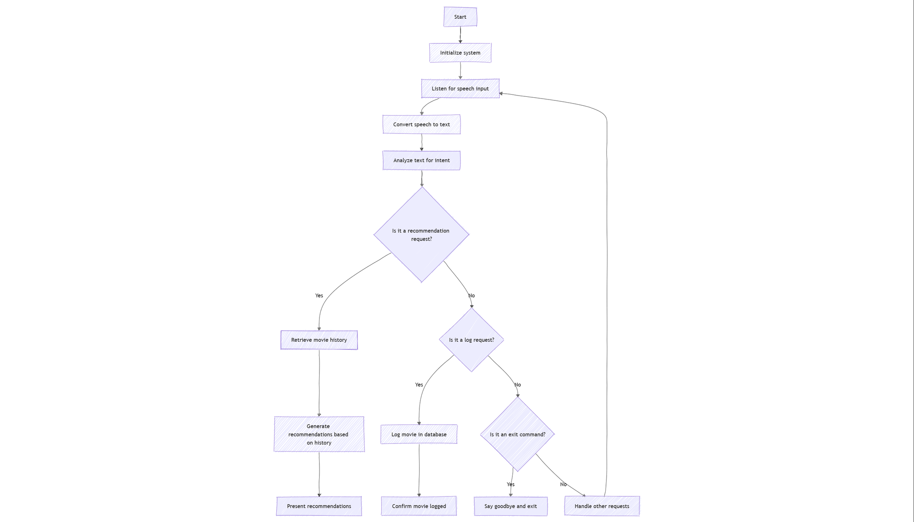
Features

    User Registration: Users can register with a unique user ID.
    Movie Management: Users can add, update, and view movies they’ve watched.
    Movie Suggestions: Search for movies by title using the OMDb API.
    Movie Recommendations: Personalized movie recommendations based on a user's movie history.
    Authentication: Basic authentication with username and password.

Endpoints
### 1. User Registration

POST /register/
Register a new user by providing a user_id and password.

### 2. Movie Suggestion

GET /suggest_movies/{current_param}
Suggest a list of movies based on the search query (movie title).


### 3. Create Movie

POST /movies/
Create a new movie entry for the authenticated user. If the imdb_id is not provided, it will be fetched using the movie title.

### 4. Get Movies by User ID

GET /movies/
Retrieve all movies added by the authenticated user.

### 5. Update Movie

PUT /movie/{movie_id}
Update an existing movie entry for the authenticated user by movie ID.

Parameters: movie_id: The ID of the movie to be updated.

### 6. Movie Recommendations
    GET /recommend_movies/
    Get personalized movie recommendations based on the movies the user has watched.

### models.py
### 1. Movie Model

Represents a movie in the database.
Fields:

    id (int, optional): Primary key for the movie record. Auto-incremented if not provided.
    imdb_id (str): Unique identifier for the movie, retrieved from IMDB.
    title (str): The title of the movie.
    year (int): The release year of the movie.
    plot (str): A brief plot summary of the movie.
    poster (str): URL to the poster image of the movie.
    genre (str): The genre(s) of the movie.
    date_watched (str): The date when the user watched the movie.
    review (str): The user's review of the movie.
    rating (int): The user's rating of the movie (typically 1-10).
    user_id (str): Foreign key to the User table, referencing the user who logged the movie.


### 2. User Model

Represents a user in the system.
Fields:
    user_id (str): The unique identifier for the user (primary key).
    password (str): The user's password, stored securely.

## Speech To Text Chatbot feature (stt.py)
### 1. SpeakText(command)

Purpose: Converts text to speech using the pyttsx3 library.

    Parameters:
        command (str): The text that should be spoken.
    Functionality:
        Initializes the pyttsx3 text-to-speech engine.
        Uses engine.say(command) to queue up the command to be spoken.
        Then, engine.runAndWait() processes and plays the speech.

### 2. recognise_speech()

Purpose: Recognizes speech input using the speech_recognition library.

    Parameters: None.

    Functionality:
        Creates a Recognizer object to process speech.
        Uses sr.Microphone() to listen to the audio input through the microphone.
        Adjusts for ambient noise to improve recognition accuracy.
        Records the audio and tries to recognize the speech using Google's speech-to-text API.
        Returns the transcribed speech as a string, in lowercase.

    Error Handling:
        If the speech is not recognized (UnknownValueError), it returns None and prints an error message.
        If there's a request issue (RequestError), it returns None and prints the error message.

### 3. Get movie details

Purpose: Fetches detailed information about a movie based on its IMDb ID using the OMDb API.

Parameters:
    imdb_id (str): The IMDb ID of the movie to fetch details for.

Functionality:
    Constructs the OMDb API request URL with the provided IMDb ID.
    Makes an API request to OMDb, and if successful, parses the response.
    Extracts the movie's title, genre, plot, year, and poster.
    If the year contains a range (e.g., "2000–2005"), it only considers the starting year.
    Returns a dictionary containing the movie's details (title, genre, plot, year, poster).
    If the request fails or the IMDb ID is not found, it returns None.

Error Handling:
    Handles connection issues with requests.exceptions.RequestException.
    Catches ValueError if the year format is invalid.

### 4. Get imdb id from title

Purpose: Retrieves the IMDb ID of a movie based on its title using the OMDb API.

Parameters:
    title (str): The title of the movie to search for.

Functionality:
    Constructs the OMDb API request URL with the provided movie title.
    Makes an API request to OMDb, and if successful, retrieves the IMDb ID.
    Returns the IMDb ID if found, or None if not found.

Error Handling:
    Handles connection issues with requests.exceptions.RequestException.

### 5. Get user movie history 

Purpose: Retrieves the movie history for a specific user.

Parameters:
    user_id (str): The ID of the user whose movie history is to be retrieved.
    session (Session): The SQLAlchemy session to interact with the database.
Functionality:
    Calls the get_movies_by_user_id function (from the db module, assumed to be responsible for database operations) to get the user's movie history.
    Returns a list of movies for the specified user.

### 6. Analyse logging intent

Purpose: Analyses if the user's input is a request to log or save a movie using a ai model trained on the permutations of the user expressing they want to log

Parameters:
    user_input (str): The user's speech input to be analyzed.

Functionality:
    Uses OpenAI's GPT-4 model to analyze the user input based on predefined examples of recommendation requests.
    Returns True if the input seems like a recommendation request, or False otherwise.

How it works:
    A prompt is fed into GPT-4, asking if the user input matches a request for a movie recommendation. The model responds with "Yes" or "No."

Error Handling:
    Handles issues with the OpenAI API response if the expected structure is not present.

### 7. Handle recommendation request

Purpose: Handles a recommendation request by generating and speaking movie recommendations based on the user's movie history.

Parameters:
    user_movies (list): A list of movies the user has watched, which will be used to generate recommendations.
    session (Session): The SQLAlchemy session to interact with the database.
Functionality:
    Calls the recommend_movies function to generate recommendations based on the user's movie history.
    Converts the recommendations into a nicely formatted JSON string and prints them.
    Uses the SpeakText function to speak the recommendations to the user.

### 8. Recommend movies

Purpose: Generates a list of movie recommendations based on the user's movie history.

Parameters:
    user_movies (list): A list of movies that the user has watched.
Functionality:
    Loops through the user's movie history and fetches details for each movie (using the get_movie_details function).
    For each movie, it uses the find_similar_movies_via_ai function to find similar movies based on the genre, plot, and year.
    Collects and returns the generated recommendations.

### 9. Find similar movies via ai

Purpose: Uses OpenAI's GPT-4 to find movies similar to a given movie but set in a different time period.

Parameters:
    genre (str): The genre of the movie.
    plot (str): The plot summary of the movie.
    year (int): The release year of the movie.

Functionality:
    Constructs a detailed prompt for GPT-4 to generate movie recommendations.
    The prompt instructs GPT-4 to find movies with similar themes or storylines, but set in a different time period (up to 40 years before or after the original movie's release).
    The response is parsed and returned as a list of movie recommendations in JSON format.

Error Handling:
    Catches json.JSONDecodeError if the GPT-4 response is not a valid JSON.

### 10. Analyse logging intent

Purpose: Analyses if the user's input is a request to log or save a movie using a ai model trained on the permutations of the user expressing they want to log

Parameters:
    user_input (str): The user's speech input to be analyzed.
Functionality:
    Similar to analyse_intent, but this time, it checks if the user's input corresponds to logging a movie (e.g., adding a movie to a watchlist).
    Uses GPT-4 to determine if the input is related to logging a movie, responding with "Yes" or "No."

### 11. Handling logging request

Purpose: Handles a request to log a movie for a user.

Parameters:
    user_id (str): The ID of the user.
    imdb_id (str): The IMDb ID of the movie to log.
    session (Session): The SQLAlchemy session to interact with the database.
Functionality:
    Fetches the movie details using the get_movie_details function.
    Calls the create_movie_from_imdb_id function (assumed to create a movie record in the database) to log the movie for the user.

### 12. Handling logging request by title

Purpose: Handles a request to log a movie based on its title.

Parameters:
    user_input (str): The title of the movie.
    user_id (str): The ID of the user.
    session (Session): The SQLAlchemy session to interact with the database.
Functionality:
    Attempts to get the IMDb ID using the get_imdb_id_from_title function.
    If the IMDb ID is found, it logs the movie using handle_logging_request.
    If no exact match is found, it searches for similar titles using get_similar_titles and lets the user choose a movie from the list.

### 13 A. Getting similar titles

Purpose: Finds movies similar to the given title using the OMDb API.

Parameters:
    title (str): The title of the movie to search for.
Functionality:
    Makes a request to the OMDb API to search for movies with similar titles.
    If successful, it returns a list of movie titles found in the search results.

 ### 13 B. Getting similar titles from openai

Purpose: The function get_similar_titles_from_openai uses OpenAI's GPT-4 model to find and recommend a list of movie titles that are most similar to a given movie title. It formulates a prompt for the AI model that asks it to identify movie titles with substrings matching the given title, while ignoring case and punctuation.

Steps:

    Prompt Construction:
        The function constructs a prompt that includes the movie title and asks the model to return 5 movie titles most similar to the given one.
    OpenAI API Request:
        The prompt is sent to OpenAI's GPT-4 model via the openai.ChatCompletion.create method, using a system message to set the assistant's role and a user message with the constructed prompt.
    Response Handling:
        Once the AI responds, the function extracts the relevant movie titles from the response and splits them into a list, which is returned.
    Error Handling:
        If there is an issue during the OpenAI API request (e.g., connectivity problems or unexpected response format), an exception is caught, and an error message is printed. The function then returns None.

Output:

    A list of movie titles (up to 5) that are most similar to the provided title, based on substring matching.

### 14. Triage Request

Purpose: Decides what action to take based on the type of user request.

Parameters:
    request_type (str): The type of request (e.g., 'log', 'recommend', 'check_recommendation').
    user_id (str): The user ID for movie logging or recommendation.
    imdb_id (str, optional): The IMDb ID for logging or checking.
    user_movies (list, optional): The user's movie history for generating recommendations.
    session (Session, optional): The database session for interaction.
    user_input (str, optional): The user's speech input for analyzing intent.
Functionality:
    Directs the request to the appropriate handler function (handle_logging_request, handle_recommendation_request, etc.) based on the request_type


# Build Instructions
The API of the project is built using FastAPI, a modern web framework for building APIs with Python. FastAPI provides a simple and efficient way to create RESTful APIs with automatic interactive documentation. We've also used Poetry for dependency management and Pydantic for data validation.

### Setup
1. Clone the repository:
```bash
git clone  https://github.com/Arpan-206/Ctrl-Shift-Alt-Win-L.git
```
2. Change the directory:
```bash
cd Ctrl-Shift-Alt-Win-L
```
3. Install the dependencies:
```bash
poetry install
```
4. Run the code (for development):
```bash
poetry run fastapi dev main.py
```
5. Open the API documentation in your browser:
```
http://localhost:8000/docs
```
6. You can test the endpoints using the interactive documentation provided by FastAPI.


# Frontend
What better way to travel through time than by immersing yourself in the worlds of the movies you've watched?
Movies allow us to experience different time periods, settings, and worlds. Whether you're in medieval times, the distant future, or a parallel universe, movies let us journey through time.
With this concept in mind, we focused on building a website with a starry, cosmic theme that represents the endless possibilities of time travel in cinema.
## UX/UI design
This is the intial vision we aimed to create.
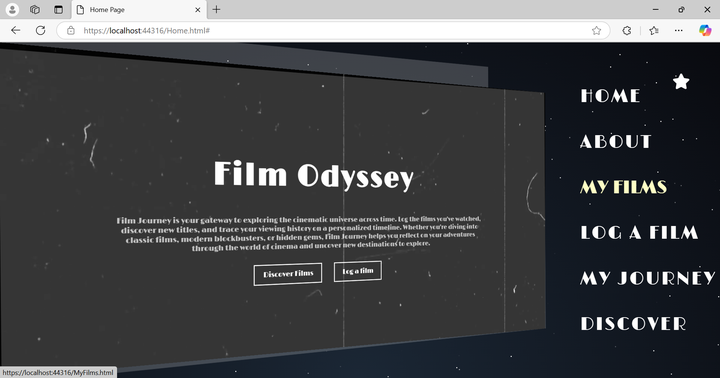
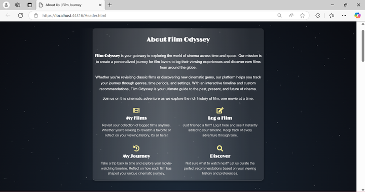
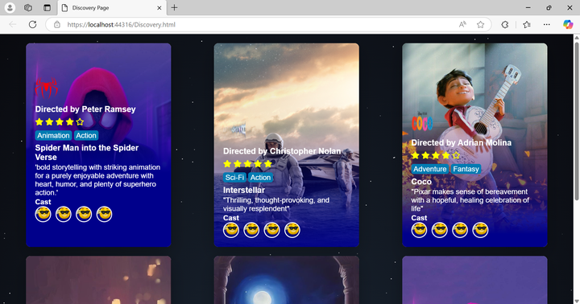
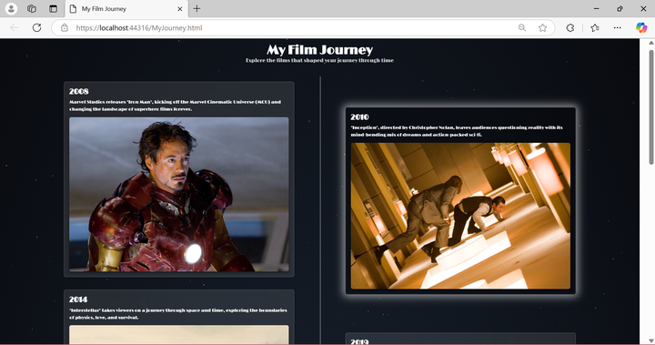
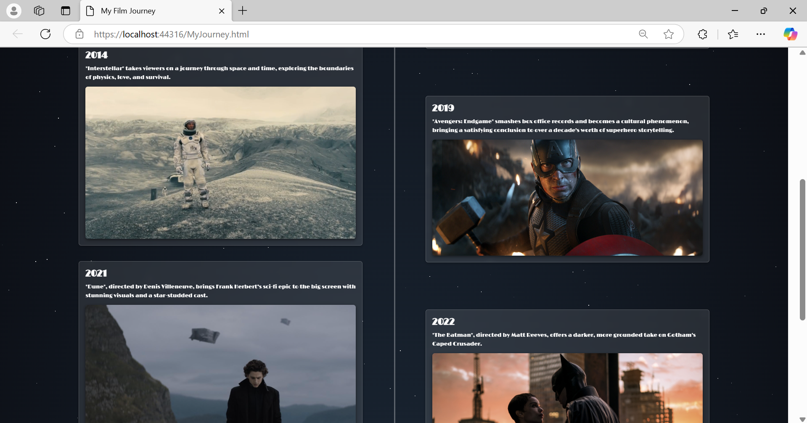

## Final Website Model
This is the final product.
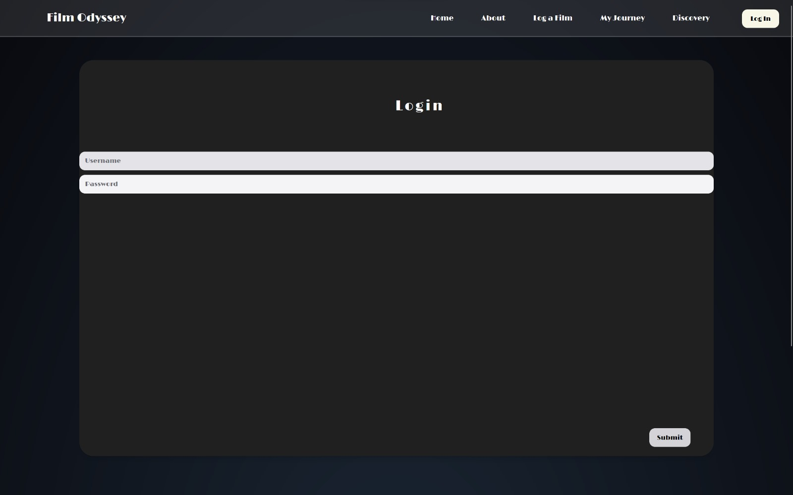
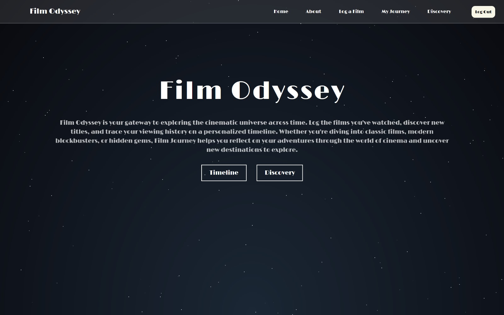
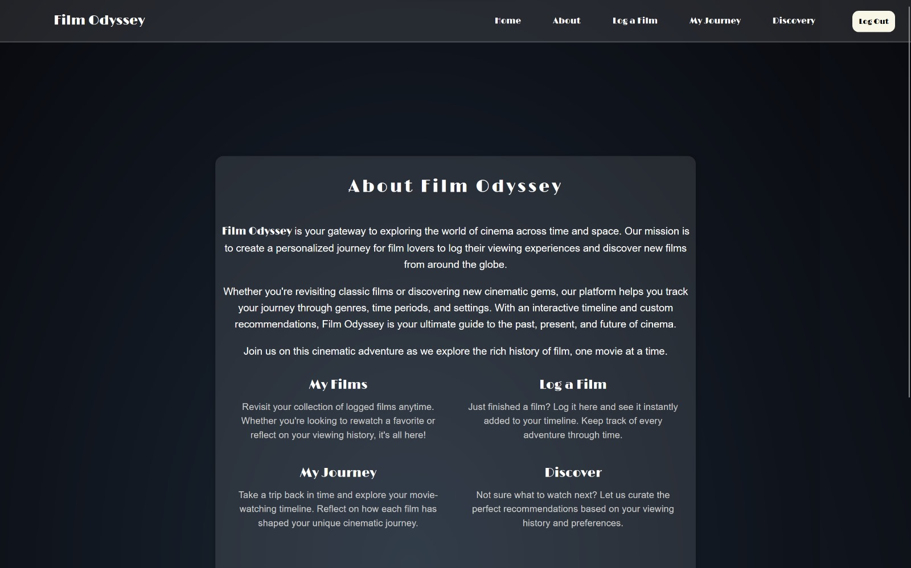
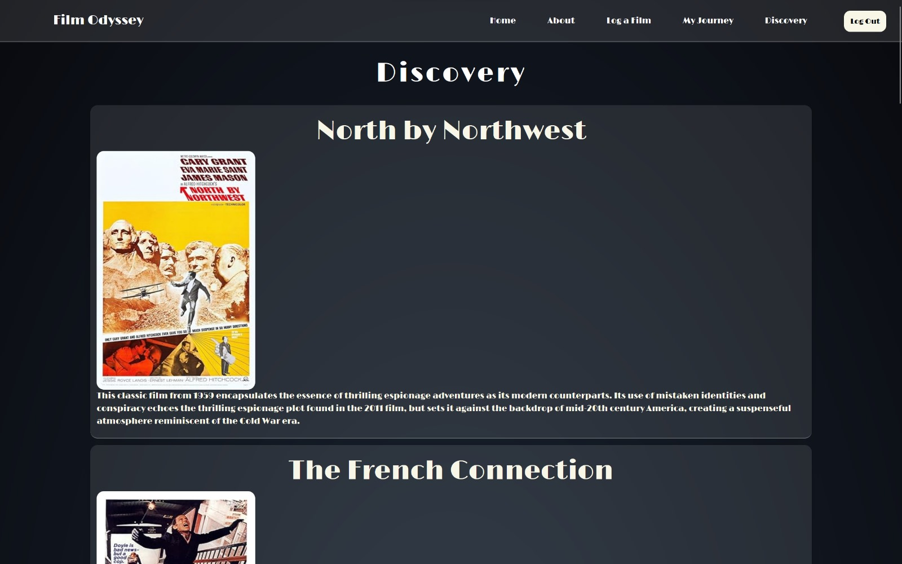
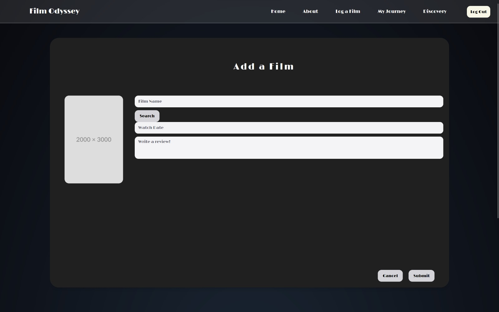
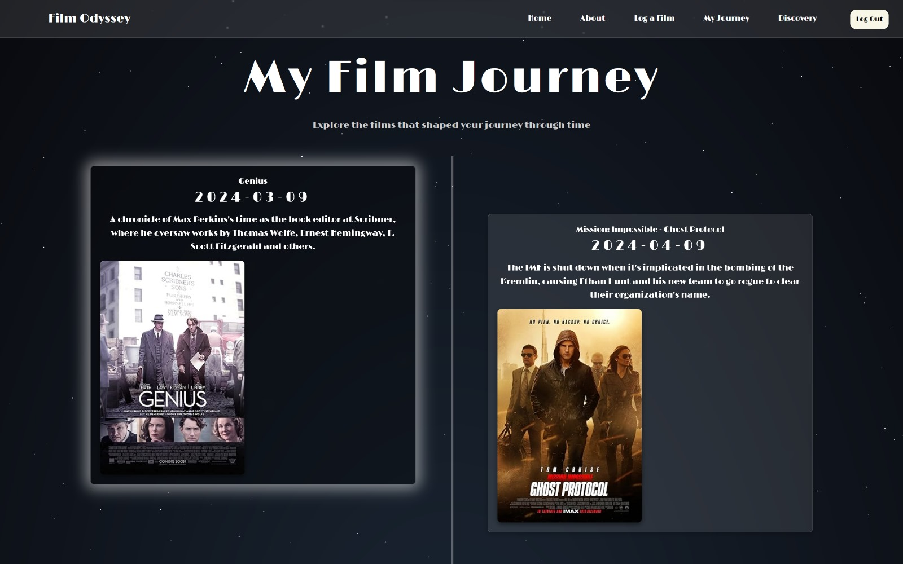

